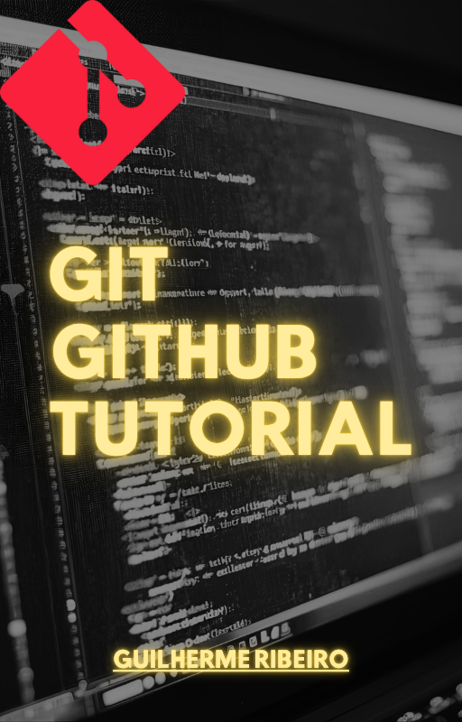
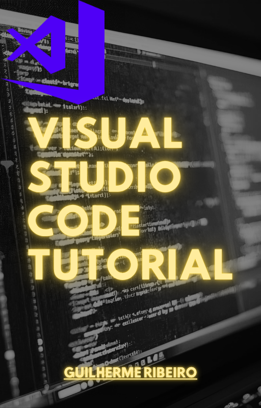

# Guilherme Ribeiro

Programador e Desenvolvedor com experiência em: **JavaScript, Node.js, Marked.js, TailwindCSS, Java, Flutter, além de versionamento utilizando Git.**    

Experiência na produção e edição de eBooks usando Markdown e Pandoc, garantindo padronização, qualidade tipográfica e conversões consistentes entre formatos.

Para este Portifólio utilizei uma Stack Front-end para site estáticos profissionais, baseada em:
- Marked.js
- Highlight.js
- TailwindCSS
- Katex/Mermaid.js (opcional)
- DOMPurify

---

   

## Ebooks

### Git e GitHub - Tutorial [2025]

  
 
 

Este ebook abrangente sobre Git e GitHub é o recurso definitivo para estudantes, programadores e desenvolvedores que desejam dominar o controle de versão e a colaboração em projetos de software. Aprenda desde os conceitos básicos até as técnicas avançadas de gerenciamento de código-fonte com Git, e descubra como utilizar eficientemente a plataforma GitHub para hospedar, compartilhar e colaborar em seus projetos.
- [PREÇO: 49,00 REAIS - EPUB/PDF]      

---

### Visual Studio Code - Tutorial [2025]

    

O Visual Studio Code (VSCode) é um editor de código leve e poderoso, muito usado no desenvolvimento web e em contextos acadêmicos. Ele permite instalar extensões que facilitam a programação em diferentes linguagens e frameworks. Há muitos tutoriais e cursos online que ensinam desde o básico até técnicas avançadas. Sua integração com Git e ferramentas de depuração torna-o ideal para projetos acadêmicos e profissionais. Além disso, a personalização com temas e atalhos aumenta a produtividade e o aprendizado.
- [PREÇO: 49,00 REAIS - EPUB/PDF]  

---

  

### Contato para Vendas 

- Atendimento direto comigo
- Envio imediato
- PIX/Transferência
- WhatsApp: (31) 99698-1103
- E-mail: topverbs@gmail.com

## Contato

- [linkedin.com/in/devgbr](https://www.linkedin.com/in/devgbr)    
- [github.com/devgbr86](https://github.com/devgbr86)

---

  

